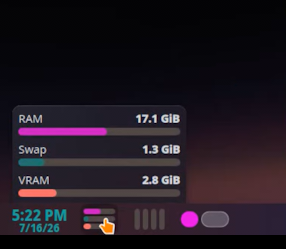
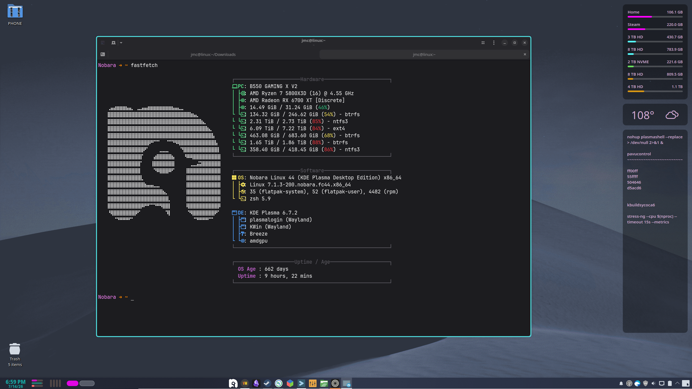

# RAM Monitor Widget

[](https://kde.org/plasma-desktop/)
[](https://doc.qt.io/qt-6/qtqml-index.html)
[](https://github.com/PlasmaDrifter)
[](LICENSE)

An elegant memory usage gauge and swap monitor for KDE Plasma 6.

---

## Previews






---

## Features

- **Active**: RAM usage percentage and gigabyte breakdown
- **Swap**: space monitoring
- **Custom**: warning threshold colors
- **Compact**: and expanded views

## Requirements

- **Environment**: KDE Plasma 6.0 or higher
- **Framework**: Qt6 QML / Plasma Applet API

## Installation

### Option 1: Git Clone (Recommended)
```bash
mkdir -p ~/.local/share/plasma/plasmoids/
git clone https://github.com/PlasmaDrifter/ram-monitor.git ~/.local/share/plasma/plasmoids/local.widget.ram-monitor
```

### Option 2: Plasma Package Installer
```bash
kpackagetool6 -i ~/.local/share/plasma/plasmoids/local.widget.ram-monitor
```

Then right-click your desktop or panel $\rightarrow$ **Add Widgets...** and search for the widget name.

## Credits & License

- **Author / Maintainer**: PlasmaDrifter
- **License**: Licensed under the [GPLv2](LICENSE).
